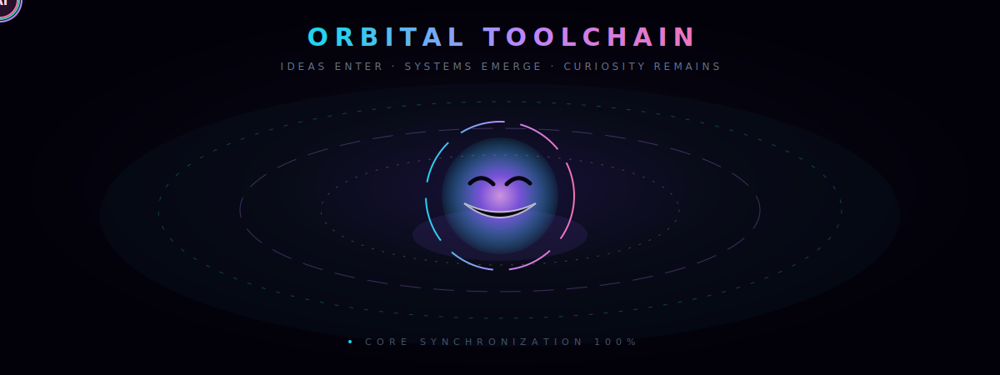
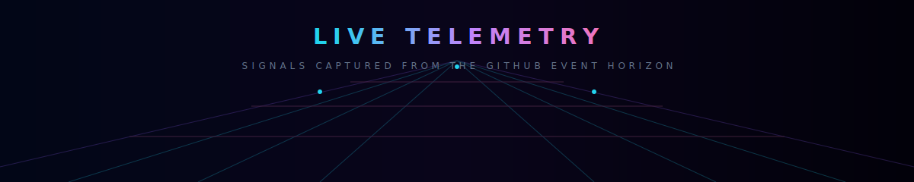
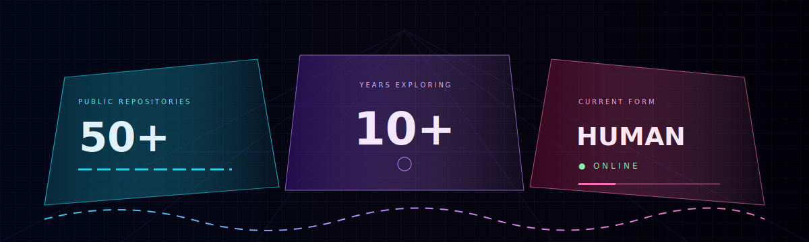
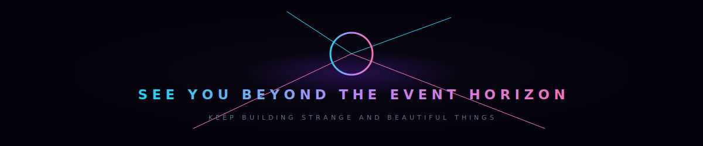

  

  
  
  

  

  
  
  
  

  

<picture>
  <source media="(prefers-color-scheme: dark)" srcset="https://raw.githubusercontent.com/CheshireJCat/CheshireJCat/output/github-contribution-grid-snake-dark.svg" />
  <source media="(prefers-color-scheme: light)" srcset="https://raw.githubusercontent.com/CheshireJCat/CheshireJCat/output/github-contribution-grid-snake.svg" />
  
</picture>

